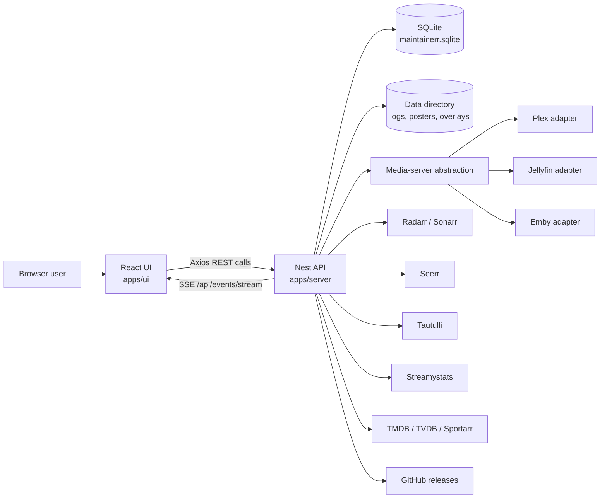

# Architecture Overview

This document gives contributors a fast map of Maintainerr's architecture. It
is tool-neutral and should support manual development, IDE workflows, and
automation equally. It is intentionally high level: use it to find the right
area of the codebase, then follow the local module, tests, and contracts for
exact behaviour.

Refresh this file when adding or removing top-level workspaces, server modules,
global UI providers, integration surfaces, persistence flows, or deployment
entry points.

## Project Structure

Maintainerr is a TypeScript monorepo managed with Turborepo and Yarn
workspaces.

```text
Maintainerr/
|-- apps/
|   |-- server/              # Nest API, jobs, integrations, persistence, logs
|   `-- ui/                  # Vite React UI, routes, client API calls
|-- packages/
|   `-- contracts/           # Shared DTOs, Zod schemas, enums, and types
|-- docs/                    # Feature-level technical notes
|-- docker/                  # Docker helper configuration
|-- tools/                   # Release and maintenance scripts
|   `-- dev/                 # Local dev mocks (fake Plex/Jellyfin) and DB seed
|-- .codex/config.toml       # Codex project MCP server config
|-- .mcp.json                # Claude Code project MCP server config
|-- .vscode/mcp.json         # VS Code MCP server config mirror
|-- Dockerfile               # Multi-stage production image
|-- README.md                # Product overview and installation entry point
|-- CONTRIBUTING.md          # Contributor setup and process
`-- turbo.json               # Workspace task graph
```

## High-Level System Flow



In production, the Nest server also serves the built UI from
`apps/server/dist/ui`. In development, Vite and Nest run through the workspace
`yarn dev` task.

## Core Components

### UI

`apps/ui` owns client routing, UI state, and API calls. It uses Vite, React,
React Router, TanStack Query, React Hook Form, TailwindCSS, and Headless UI.

- `src/router.tsx` is the route source of truth. It uses eager shell routes and
  lazy feature pages with preload support.
- `src/main.tsx` wires the global provider stack:
  `QueryClientProvider -> EventsProvider -> TaskStatusProvider -> SearchContextProvider -> RouterProvider`.
- `src/utils/ApiHandler.tsx` centralises API base path handling and Axios REST
  helpers.
- `src/contexts/events-context.tsx` opens the reconnecting SSE stream and
  exports `useEvent` for typed feature subscriptions.
- `src/contexts/taskstatus-context.tsx` combines initial task status queries
  with live rule and collection handler events.
- `src/contexts/search-context.tsx` owns global search text shared across
  searchable list views.
- `src/components/Common/` contains shared UI primitives. Prefer existing
  buttons, loading boundaries, modals, tables, and feedback patterns before
  adding new ones.

### Server

`apps/server` owns the Nest application, background jobs, persistence, external
integrations, and production static serving.

- `src/main.ts` bootstraps Nest, validates the data directory, configures base
  path handling, Swagger, CORS, logging, and graceful shutdown.
- `src/app/app.module.ts` wires TypeORM, events, static serving, and feature
  modules.
- `src/modules/settings/` stores user configuration and coordinates media
  server switching.
- `src/modules/api/media-server/` provides the server-agnostic media server
  interface, factory, controller, and shared utilities.
- `src/modules/api/media-server/plex/`,
  `src/modules/api/media-server/jellyfin/`, and
  `src/modules/api/media-server/emby/` contain server-specific adapters,
  constants, mappers, caching, and SDK/API calls.
- Other `src/modules/api/` submodules wrap integration clients and helper
  APIs, including Plex legacy routes, Servarr, Seerr, Tautulli, Streamystats, TMDB, TVDB,
  the Sportarr metadata API,
  GitHub, external API, internal API, and shared request/cache helpers.
- `src/modules/rules/` evaluates rule groups against media-server and external
  service data.
- `src/modules/collections/` tracks matched media, exclusions, collection logs,
  posters, and collection handling actions.
  Scheduled, global manual, and per-collection action runs share the same
  worker and due-item eligibility checks.
- `src/modules/media-analytics/` composes media, collection and analytics APIs
  for source-specific browsing snapshots. It sorts complete snapshots before
  pagination and keeps native media-server collection ordering independent.
  Item details normalize Tracearr and Streamystats data into one shared
  contract and UI panel, while preserving each provider's recorded history.
  Detailed user and episode statistics are fetched separately from the compact
  summaries used for sorting.
- `src/modules/actions/` contains the Radarr, Sonarr and Sportarr action handlers
  for destructive or state-changing Servarr actions such as delete, unmonitor,
  and quality profile changes, plus the opt-in leftover-folder cleanup - the one
  place in the module that writes to the local filesystem.
- `src/modules/tasks/` creates and tracks scheduled jobs.
- `src/modules/telemetry/` builds and sends the anonymous weekly usage
  report, scheduled on a per-instance jitter slot.
- `src/modules/events/` exposes server-sent events for rule and collection job
  progress.
- `src/modules/version/` resolves the running build against GitHub, for the
  version indicator and the update-available notification.
- `src/modules/overlays/`, `src/modules/metadata/`,
  `src/modules/notifications/`, `src/modules/logging/`, and
  `src/modules/storage-metrics/` own their respective feature areas.

### Contracts

`packages/contracts` owns shared DTOs, Zod schemas, enums, and cross-package
types. Add request/response shapes here only when they are deliberately shared
between the UI and server. Keep new contracts minimal and validate external
input at system boundaries.

## Data Stores

Maintainerr stores local state in SQLite through TypeORM.

- Development database: `data/maintainerr.sqlite`.
- Production database: `${DATA_DIR}/maintainerr.sqlite`, defaulting to
  `/opt/data/maintainerr.sqlite`.
- TypeORM loads entities with `autoLoadEntities` and runs migrations
  automatically on server start.
- Migration files live in `apps/server/src/database/migrations/`.
- `apps/server/src/datasource-config.ts` is the TypeORM CLI data source used
  for migration generation and execution.
- Schema changes must use the TypeORM workflow in
  [typeorm_instructions.txt](typeorm_instructions.txt); do not hand-write SQL
  migrations.

The data directory also stores operational files such as logs, custom
collection posters, overlay images, original artwork backups, and other
runtime assets. The Docker image exposes `/opt/data` as a volume.

## External Integrations

Maintainerr integrates with:

- Plex, Jellyfin, and Emby through the media-server abstraction.
- Radarr and Sonarr for unmonitoring, deleting, and quality profile actions.
- Seerr-compatible services for request cleanup.
- Tautulli for Plex analytics and rule data.
- Streamystats for Jellyfin item-level analytics surfaced on the media modal.
  Authentication reuses the configured Jellyfin API key. Emby is not supported
  upstream.
- Tracearr for server-scoped playback history used in rules, browsing sorts,
  and the shared analytics panel on media details.
- TMDB and TVDB for metadata resolution, and the Sportarr metadata API for
  Sportarr leagues, which answers ahead of the primary provider for a show
  that carries a Sportarr id. It reads the configured Sportarr connections,
  and sportarr.net only when `SPORTARR_NET=on` asks for it.
- GitHub for release/version checks.
- The Maintainerr telemetry collector for the anonymous weekly usage report,
  when it is enabled (see the Telemetry section of the README).
- Notification providers such as Discord, Slack, Telegram, Pushover, Gotify,
  ntfy, email, Pushbullet, LunaSea, and webhooks.

When changing an external integration, confirm current behaviour from the
official API documentation before coding. Keep third-party secrets in settings
or environment variables; never hard-code tokens or keys.

## Deployment and Runtime

The production Docker image builds all workspaces, focuses production
dependencies, copies the UI build into the server distribution, and starts the
Nest server through `docker/start.sh`.

Important runtime environment variables include:

- `DATA_DIR`: production data directory, default `/opt/data`.
- `UI_PORT`: HTTP listen port, default `6246`.
- `UI_HOSTNAME`: HTTP bind host, default `0.0.0.0`.
- `BASE_PATH`: optional subdirectory mount path for both API and UI serving.
- `GITHUB_TOKEN`: optional token for higher GitHub API rate limits.
- `TELEMETRY`: set to `off` to disable the anonymous weekly usage report,
  whatever the stored setting says.
- `SPORTARR_NET`: set to `on` to read Sportarr league artwork and
  descriptions from sportarr.net for a league none of the configured Sportarr
  connections tracks. Off by default, so an install without Sportarr never
  calls it.
- `VERSION_TAG` and `GIT_SHA`: release metadata surfaced by the app.
- `LOG_LEVEL`: optional process-local log level override; recognised values
  take precedence over the saved setting without writing the database.
- `DEBUG`: influences default log level during migration seeding.

The server exposes health probes under `/api/health`: `/live` is process-only,
`/ready` checks database readiness, and `/api/health` mirrors readiness. The
Docker image runs `/opt/app/healthcheck.sh`, normalises `BASE_PATH`, and probes
`/api/health/ready` on the local `UI_PORT`.

## Security Notes

- Treat configured integration tokens and API keys as secrets.
- Keep user-provided URLs and external API responses validated or normalised at
  system boundaries.
- Prefer typed DTOs and Zod schemas for request/response data.
- Avoid logging raw secrets. Use existing secret masking helpers where
  available.
- Keep destructive actions explicit: delete, unmonitor, and quality-profile
  changes should remain tied to collection/rule configuration and action
  handlers.

## Development and Testing

Run workspace commands from the repository root.

```bash
yarn install
yarn dev
yarn lint
yarn check-types
yarn test
yarn build
```

Closest quality gates should run in this order where applicable: lint,
typecheck, tests, then build. For doc-only changes, a targeted Prettier check is
usually enough.

GitHub CI mirrors the root workspace workflow on Node.js 26: the formatting
and TypeScript lint jobs run `corepack install`, `corepack enable`, and
`yarn --immutable`, while the quality workflow also includes a separate
`yaml-lint` job running `yamllint -s .`; the test workflow builds `packages/*`
before `yarn turbo test`. The development image workflow builds the production
`Dockerfile` for `linux/amd64` and `linux/arm64`.

Testing conventions:

- Server tests use Jest, with `*.spec.ts` files near the code under
  `apps/server/src`.
- UI tests use Vitest and React Testing Library.
- Contracts use TypeScript checks and package-level linting.
- Project MCP server config lives in `.codex/config.toml`, `.mcp.json`, and
  `.vscode/mcp.json`; keep them in sync. The GitHub MCP server is read-only,
  and Playwright screenshots should be saved under `.playwright-mcp/`.
- End-to-end checks of media-server-dependent flows use the dev mocks and DB
  seed under `tools/dev/` (`fake-plex.mjs` / `fake-jellyfin.mjs` +
  `seed-db.mjs`) to drive the UI with Playwright against deterministic data;
  see `AGENTS.md` for the workflow.

See `CONTRIBUTING.md` for setup, branching, and pull request expectations.

## Architecture Guardrails

- Keep `modules/api/media-server/` server-agnostic. The shared interface,
  factory, controller, and utilities must not import Plex or Jellyfin types.
- Put server-specific logic under the matching adapter directory (`plex/`,
  `jellyfin/`, or `emby/`).
- Use `supportsFeature()` for conditional media-server capabilities.
- Implement every new media-server interface method for all supported media
  servers. Put partial support behind feature checks, not optional interface
  holes.
- Keep mappers focused on type conversion, not business decisions.
- Prefer shared settings feedback, loading, and button components in the UI.
- Avoid layout shift in shell and settings flows.
- Preserve established rule `name` and `humanName` conventions across media
  servers.
- Keep migrations safe, reversible, and generated through TypeORM.

## Feature References

Feature documentation lives in the `Maintainerr_docs` repository and is published
at <https://docs.maintainerr.info>. It is the single source of truth: describe a
feature there, not here, so the two cannot drift. This repository documents
architecture and intent only; for how the code works, read the code.

- <https://docs.maintainerr.info/collections/> covers custom collection posters
  and the per-collection opt-in post-delete folder cleanup, including which
  \*arr actions strand a folder, the same-path mount requirement, and the
  guardrails.
- <https://docs.maintainerr.info/overlays/> covers overlay templates, settings,
  and processing behaviour.
- `README.md` describes product capabilities, installation, API compatibility,
  and supported services.

## Glossary

- Arr: Shorthand for Radarr and Sonarr.
- Collection handler: Background logic that applies configured actions to media
  after it has spent the configured duration in a Maintainerr collection.
- Contracts: Shared package containing DTOs, schemas, enums, and types used by
  both UI and server.
- Data directory: Runtime directory containing the SQLite database and local
  files such as logs, posters, and overlays.
- Media-server abstraction: Server-side interface that lets Maintainerr support
  Plex, Jellyfin, and Emby without leaking their implementation details into
  shared code.
- Rule group: A configured set of rules that selects media and links it to a
  Maintainerr collection.
- Seerr: The request-management integration (github.com/seerr-team/seerr) used
  for request cleanup.
- SSE: Server-sent events used for live rule and collection job updates.
